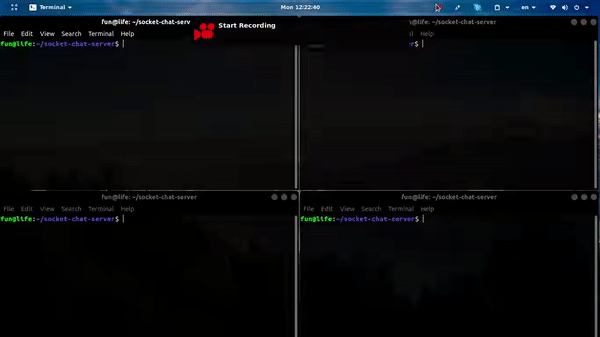

# Socket Chat Server
Python socket chat server with multiple clients

Demo
=


How to use
=
## Clone project
```
git clone https://github.com/pubuser7/socket-chat-server.git
```
## Run server
```
python server.py
```
## Run clients
```
python client.py HOST PORT
```